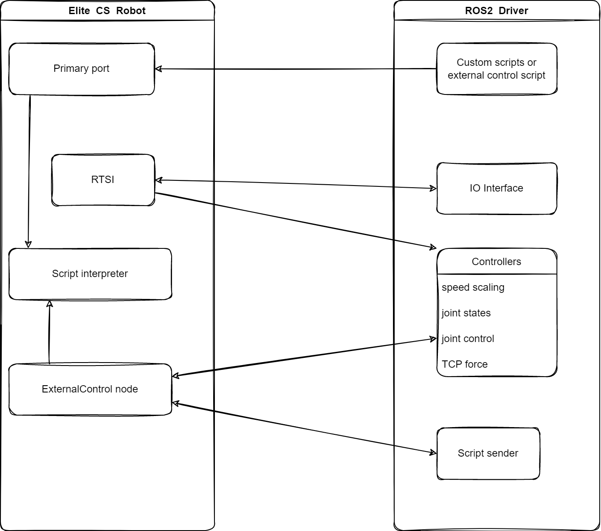

# eli_cs_robot_driver
&emsp;&emsp;This package contains the actual driver for Elite CS robots. It is part of the Elite_Robots_CS_ROS2_Driver repository and requires other packages from that repository. Also, see the main repository's README for information on how to install and startup this driver.

## Technical details

&emsp;&emsp;The following image shows a very coarse overview of the driver's architecture.

&emsp;&emsp;Real-time data from the robot is read through the RTSI interface. This is done automatically as soon as a connection to the robot could be established. Thus joint states and IO data will be immediately available.

&emsp;&emsp;To actually control the robot, a task node from the External Control ELICOs must be running on the robot interpreting commands sent from an external source. When this program is not running, no controllers moving the robot around will be available. Please see the [doc/ExternalControl-guide-en.pdf](./doc/ExternalControl-guide-en.pdf) on how to install and start this on the robot.

&emsp;&emsp;Custom script snippets can be sent to the robot on a topic basis. By default, they will interrupt other programs (such as the one controlling the robot). For a certain subset of functions, it is however possible to send them as secondary programs. See [Elite documentation](https://www.eliterobots.com/downloads) on details.

&emsp;&emsp;Note: If enbale remote control, the robot won't accept script code from a remote source unless the robot is put into remote_control-mode. However, if put into remote_control-mode, the program containing the ExternalControl task node can't be started from the panel. For this purpose, please use the dashboard services to load, start and stop the main task running on the robot. See the [ROS-API documentation](../doc/ROS2Interface.md) for details on the dashboard services.

&emsp;&emsp;This driver is using ROS-Control for any control statements. Therefore, it can be used with all position-based controllers available in ROS-Control. However, we recommend using the controllers from the eli_cs_controllers package. See it's [documentation](../eli_cs_controllers/README.md) for details. Note: Speed scaling support will only be available using the controllers from eli_cs_controllers.

## A note about modes

The term mode is used in different meanings inside this driver.

### Remote control mode
&emsp;&emsp;On the robot itself can operate in different command modes: It can be either in **local controlmode** where the teach pendant is the single point of command or in **remote control mode**, where motions from the TP, starting & loading programs from the TP activating the freedrive mode are blocked. Note that the **remote control mode** has to be explicitly enabled in the robot's settings under **Settings** -> **System** -> **Remote Control**. See the robot's manual for details.

The **remote control mode** is needed for many aspects of this driver such as
 * headless mode (see below)
 * sending script code to the robot
 * many dashboard functionalities such as
   * restarting the robot after protective / EM-Stop
   * powering on the robot and do brake release
   * loading and starting programs

### Headless mode
&emsp;&emsp;Inside this driver, there's the **headless** mode, which can be either enabled or not. When the [headless mode](../doc/ROS2Interface.md#headless_mode) is activated, required script code for external control will be sent to the robot directly when the driver starts. As soon as other script code is sent to the robot either by sending it directly through this driver or by pressing any motion-related button on the teach pendant, the script will be overwritten by this action and has to be restarted by using the [resend_external_script](../doc/ROS2Interface.md#resend_external_scriptstd_srvssrvtrigger) service. If this is necessary, you will see the output `Connection to robot dropped, waiting for new connection.` from the driver. Note that pressing "play" on the TP won't start the external control again, but whatever program is currently loaded on the controller. This mode doesn't require the "ExternalControl" EliCOs being installed on the robot as the program is sent to the robot directly.

## controller_stopper
&emsp;&emsp;A small helper node that stops and restarts ROS controllers based on a boolean status topic. When the status goes to `false`, all running controllers except a set of predefined *consistent_controllers* gets stopped. If status returns to `true` the stopped controllers are restarted.

&emsp;&emsp;This is done by Subscribing to a robot's running state topic. Ideally this topic is latched and only publishes on changes. However, this node only reacts on state changes, so a state published each cycle would also be fine.
