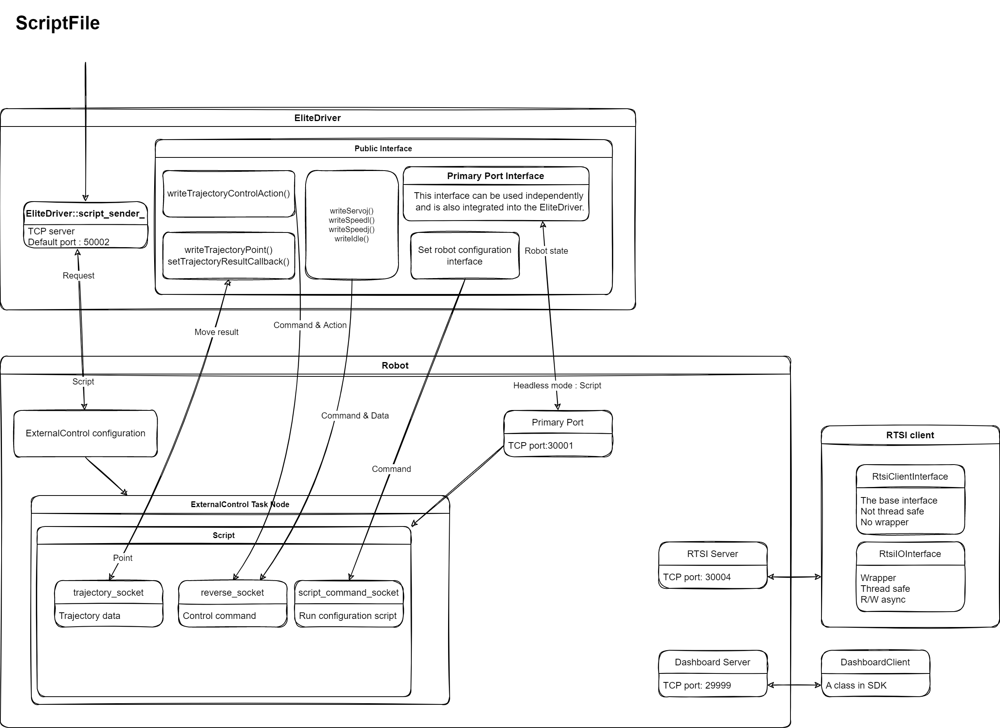
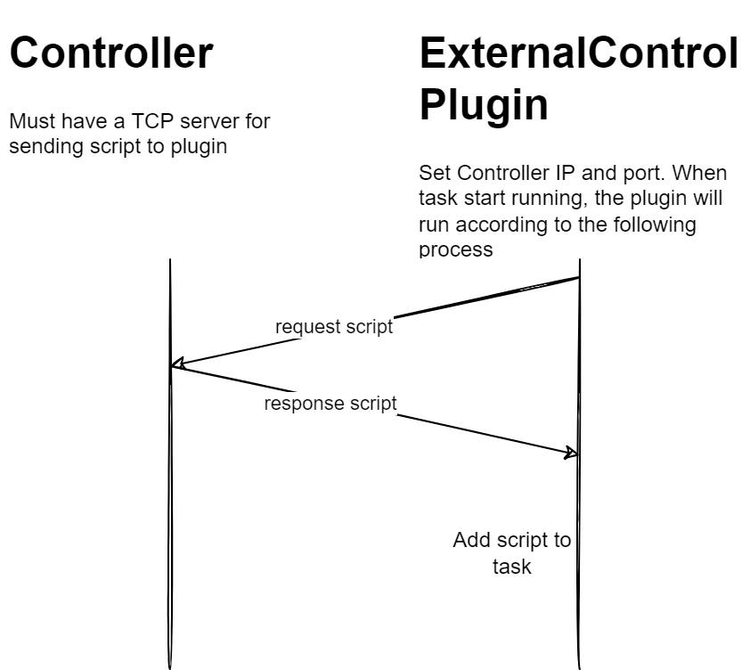
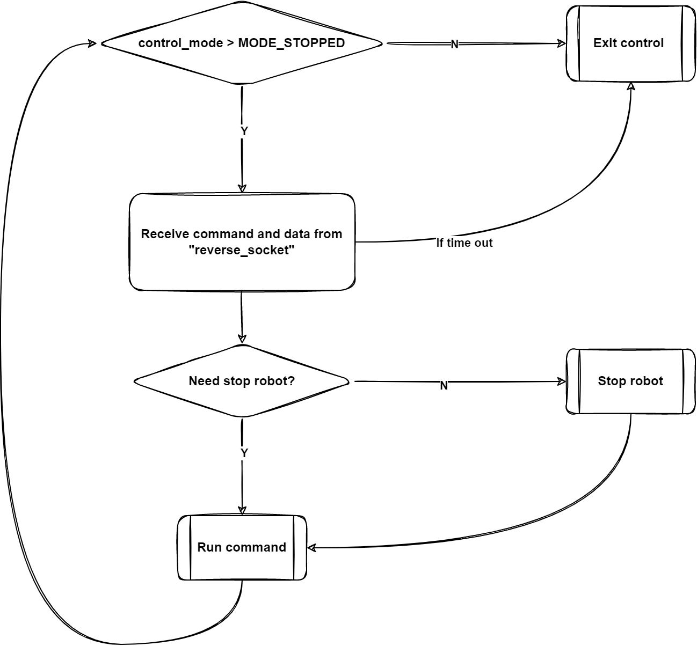
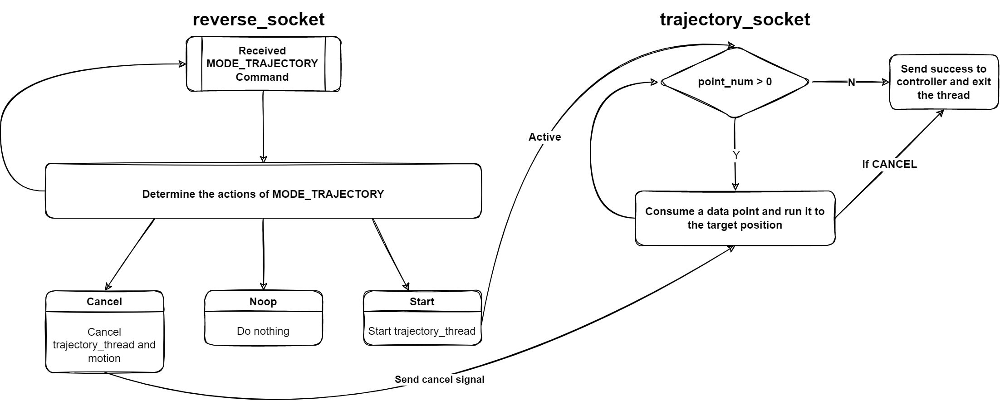

# The Architecture of the SDK

## 1. Architecture
The following figure roughly shows the data flow relationship between the SDK and the robot, which is also the architecture of the SDK:


Here are some explanations about the architecture diagram:
- Script File: Refers to the location of the `external_control.script` script, which will be read by `EliDriver`.
- EliDriver: Refers to the `EliDriver` class.
- Robot: Refers to the robot itself.
- RTSI Client: Refers to the RTSI module in the SDK.
- DashboardClient: Refers to the Dashboard module in the SDK.

Next, the working principle of EliDriver will be explained in detail. The remaining modules directly correspond to the functions of the robot. You can learn about their usage through the [User Guide](../UserGuide/en/UserGuide.en.md). The working principles behind them are not difficult to understand, so we won't elaborate on them here.

## 2. EliDriver

EliDriver is a class that controls the movement of the robot and sets the robot's configuration. This article mainly elaborates on its working principle. Before starting the explanation, it is necessary to understand the workflow of the `ExternalControl` plugin.  

### 2.1 The ExternalControl Plugin
Briefly speaking, the `ExternalControl` plugin follows the process of "request script ---> receive and process script ---> run script". After starting the task, the plugin will send the string `request\n` to the external controller to request a script. After receiving the request, the external controller will send a script to the plugin. The format of the script is as follows:
```python
# HEADER_BEGIN
...
# HEADER_END

# NODE_CONTROL_LOOP_BEGINS
...
# NODE_CONTROL_LOOP_ENDS

```
The plugin divides the script into two parts, "header" and "control loop", according to the above format. The contents of these two parts are "declaration" and "execution" respectively. For example:
```python
# HEADER_BEGIN
# Declares the printHello() function
def printHello():
    textmsg("Hello")
# HEADER_END

# NODE_CONTROL_LOOP_BEGINS
# Executes printHello()
printHello()
# NODE_CONTROL_LOOP_ENDS

```
It can be guessed that the external controller needs to create a TCP server, and the port corresponds to the `Custom port` configured in the plugin. When receiving the string `request\n`, it needs to reply with a script that meets the format requirements. The following figure briefly describes the entire workflow:


### 2.2 Working Principle of EliDriver

#### 2.2.1 ScriptSender

> `ScriptSender` is a class that creates a TCP server during construction. When it receives `request\n`, it replies with a script. Main code: `source/Control/ScriptSender.cpp`

Since the `ExternalControl` plugin is a process of receiving and running scripts, `EliDriver` will read the script - "external_control.script" during initialization and write parameters according to the rules. After receiving the request for a script, it will call `ScriptSender` to send the script to the plugin.  


#### 2.2.2 external_control.script

> Script location: `source/resources/external_control.script`

The basic logic of the `external_control.script` script is to use the socket interface to connect to the `EliDriver` external controller, and read instructions and data through the socket and execute them.  

Let's directly look at the content after `NODE_CONTROL_LOOP_BEGINS` in the script. At the beginning, the script calls `socket_open()` to create several sockets. Later, we will explain the function of each socket in combination with the code in the SDK. For now, let's mainly look at the `reverse_socket`. This socket is mainly used to receive motion instructions and data from the external controller. Then, looking further, we can see a `while` loop. This is the control loop of the robot, which obtains instructions, positions, speeds, and other information from the packets received through the `reverse_socket`. The following is the process of this loop:


> Here, you can see strings in the format of `{{SERVER_IP_REPLACE}}`. These will be replaced with the robot's IP, port, and other parameters when the script is executed. These parameters are passed in during the construction of `EliDriver`.

On the right side of the step "Receive command and data from reverse_socket", there is a judgment of "If time out". When it is executed for the first time, the time out value is 0, which means waiting indefinitely (refer to the content of the "socket_read_binary_integer()" instruction in the Elite CS script manual). After receiving the instruction, the time out value will be updated, and the updated value is included in the instruction. That is, after executing the instruction, when receiving the instructions and data from the `reverse_socket` again, it will wait according to the time out value received last time.  
After receiving the instructions and data, it will judge whether it is an instruction to "stop the robot". If so, it will execute the "stopj()" instruction.

#### 2.2.3 ReverseInterface

> `ReverseInterface` is a class that creates a TCP server during construction for sending instructions and data to the robot's `reverse_socket` socket. Main code: `source/Control/ReverseInterface.cpp`

Now let's look at the `writeServoj()`, `writeSpeedl()`, `writeSpeedj()`, and `writeIdle()` interfaces in `EliDriver`. For these interfaces, they all send "instruction + position or speed" to the robot's `reverse_socket` through `ReverseInterface`. After receiving the instruction, the script will start a thread to execute the motion, while the main thread will keep receiving data from the `reverse_socket` to update the motion data or mode.  


#### 2.2.4 TrajectoryInterface

> `TrajectoryInterface` is a class that creates a TCP server during construction for sending instructions and data to the robot's `trajectory_socket` socket. Main code: `source/Control/TrajectoryInterface.cpp`.

This interface needs to be viewed together with `ReverseInterface`. The following is the workflow diagram of `TrajectoryInterface`:


There are several interfaces in `EliDriver` such as `writeTrajectoryPoint()`, `writeTrajectoryControlAction()`, and `setTrajectoryResultCallback()`.  

In the script, it first receives a "Trajectory" instruction through the `reverse_socket`. If it is a start instruction (corresponding to `writeTrajectoryControlAction(TrajectoryControlAction::START,...)`), it will start a thread. The `trajectory_socket` of this thread is responsible for receiving positions and moving to those positions (corresponding to `writeTrajectoryPoint(...)`). At the same time, the main thread will keep receiving instructions and data from the `reverse_socket`. Therefore, before the robot moves to the position, it is necessary to send a null operation of "Trajectory" to ensure that the `reverse_socket` does not time out. When the motion ends, if the `setTrajectoryResultCallback()` is used to set a callback, this callback function will be called and the result will be informed.


#### 2.2.5 ScriptCommandInterface

> `ScriptCommandInterface` is a class that creates a TCP server during construction for sending instructions and data to the robot's `script_command_socket` socket. Main code: `source/Control/ScriptCommandInterface.cpp`.

When the `external_control.script` script opens a socket connection, it opens a socket connection named "script_command_socket". When initializing the `script_command_thread_handle` variable, it directly creates a thread. This thread will continuously receive instructions and data from the "script_command_socket" and execute corresponding actions, such as setting the load, setting the tool voltage, etc. This interface is mainly used for the configuration of the robot.  